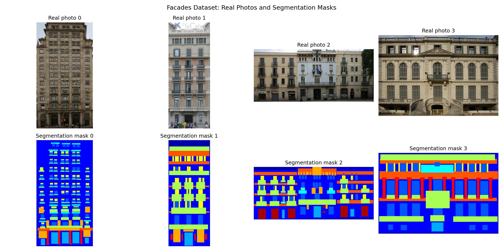
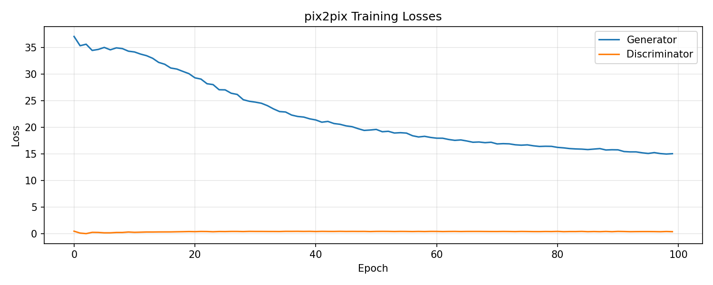
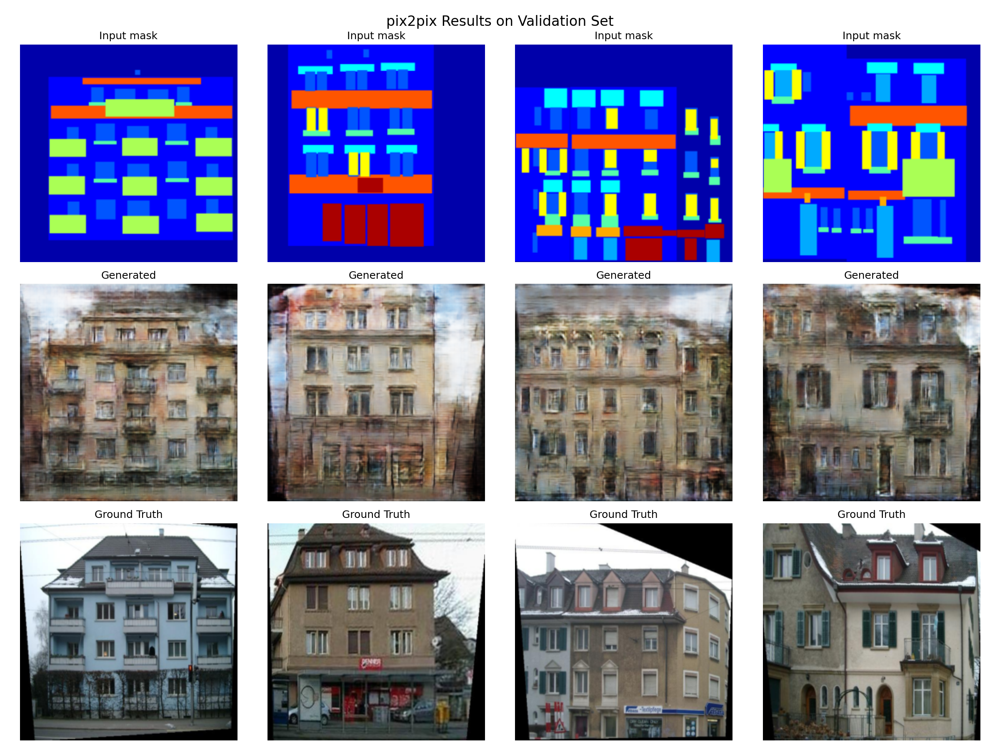
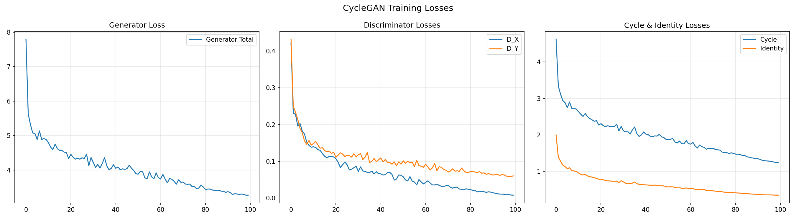
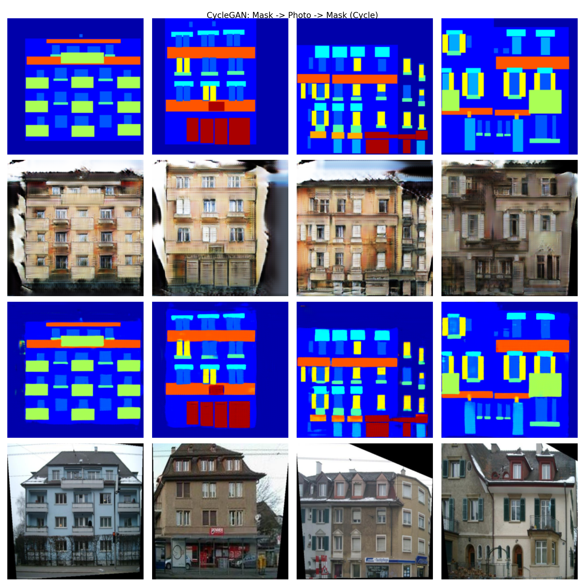
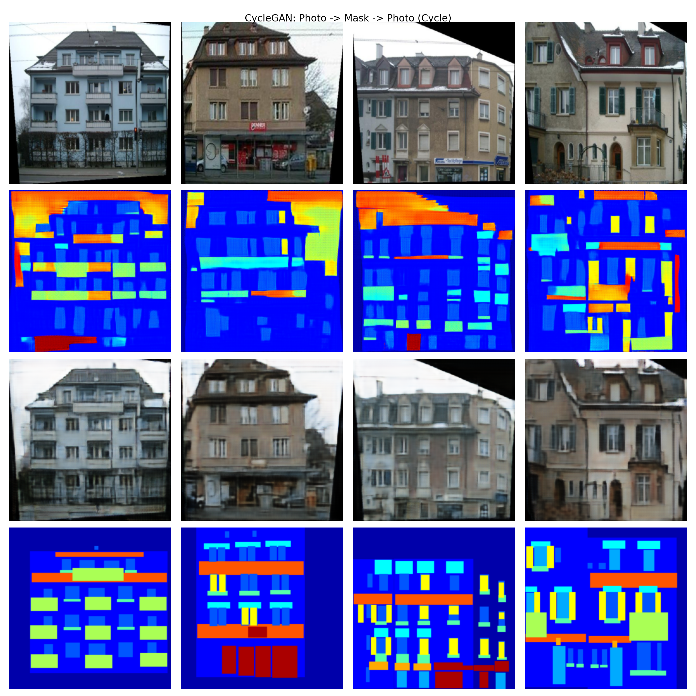

# Generative Adversarial Networks: pix2pix & CycleGAN

Style transfer on the **CMP Facades dataset** using two GAN architectures: paired (pix2pix) and unpaired (CycleGAN) image-to-image translation.

## Dataset

The [CMP Facades dataset](https://cmp.felk.cvut.cz/~tylecr1/facade/CMP_facade_DB_base.zip) contains 378 paired images of building facades and their corresponding segmentation masks. We split it into 340 training and 38 validation samples.



---

## Part 1: pix2pix (Isola et al., 2016)

### Architecture

pix2pix is a **conditional GAN** for paired image-to-image translation. The key idea is that the generator receives the segmentation mask as input and must produce a realistic facade photo, while the discriminator sees both the mask and the photo (real or generated) and decides if the pair is real.

- **Generator (U-Net)**: Encoder-decoder with 8 downsampling and 8 upsampling layers connected by skip connections. The encoder captures global context (what kind of building), while skip connections preserve fine spatial details (window positions, edges). Total: **54.4M parameters**.

- **Discriminator (PatchGAN)**: Instead of producing a single real/fake score for the whole image, it outputs a 32×32 grid where each cell classifies a ~70×70 pixel patch. This forces the generator to produce realistic local textures (brick patterns, window frames) while the L1 loss handles global structure.

- **Loss function**: `L = L_GAN(G, D) + λ · L1(G)` where λ=100. The adversarial loss pushes the generator to produce realistic textures, while the L1 loss ensures the output stays close to the ground truth and prevents mode collapse.

### Training

- Optimizer: Adam (lr=2×10⁻⁴, β₁=0.5, β₂=0.999)
- Epochs: 100
- Batch size: 4
- Training time: ~20 minutes on RTX 3060

### Training Losses



**Analysis of training dynamics:**
- The generator loss decreases steadily from ~37 to ~15, indicating that the model progressively learns to produce more accurate facade images. The dominant component is L1 loss (weighted by λ=100), so this decrease reflects improving pixel-level accuracy.
- The discriminator loss stabilizes around 0.4, which is close to the theoretical optimum of `−log(2) ≈ 0.693` for a balanced GAN. Values below this suggest the discriminator maintains a slight advantage, which is healthy — it provides a useful learning signal to the generator without overpowering it.
- The smooth, monotonic decrease without oscillations indicates stable training, which is typical for pix2pix thanks to the strong L1 regularization.

### Results



**Observations:**
- The generator successfully captures the overall structure: walls, windows, doors, and roofs are placed in correct positions matching the segmentation mask.
- Colors and materials are plausible — the model learns that walls are typically beige/gray, windows are dark, and doors have distinct frames.
- Some fine details (ornamental elements, window reflections) are blurred, which is a known limitation of L1 loss — it tends to average over multiple plausible outputs.
- The PatchGAN discriminator successfully encourages local texture realism — generated surfaces have realistic brick/plaster patterns rather than flat colors.

---

## Part 2: CycleGAN (Zhu et al., 2017)

### Architecture

CycleGAN enables **unpaired** image-to-image translation. The key innovation is the **cycle consistency loss**: if we translate a mask to a photo and back to a mask, we should recover the original. This eliminates the need for paired training data.

- **Two Generators (ResNet-based)**: G: mask→photo, F: photo→mask. Each uses 6 residual blocks with InstanceNorm (better than BatchNorm for style transfer as it normalizes per-instance, not per-batch). ReflectionPadding reduces border artifacts. Total: **7.8M parameters each**.

- **Two Discriminators (PatchGAN)**: D_Y distinguishes real photos from generated, D_X distinguishes real masks from generated. Use InstanceNorm and take single images (not concatenated pairs like pix2pix).

- **Loss function**: `L = L_GAN(G, D_Y) + L_GAN(F, D_X) + λ_cyc · L_cyc(G, F) + λ_id · L_id(G, F)`
  - **Adversarial loss** (MSE/LSGAN — more stable than BCE): makes outputs look realistic
  - **Cycle consistency** (λ=10): x → G(x) → F(G(x)) ≈ x ensures structural preservation
  - **Identity loss** (λ=5): G(y) ≈ y prevents unnecessary color changes

- **Replay buffer** (size 50): stores previously generated images to update discriminators, preventing them from overfitting to the latest generator output (Shrivastava et al., 2017).

### Training

- Optimizer: Adam (lr=2×10⁻⁴, β₁=0.5, β₂=0.999)
- Learning rate: linear decay to 0 in the second half of training
- Epochs: 100
- Batch size: 1 (due to 4 models in GPU memory simultaneously)
- Training time: ~3 hours on RTX 3060
- Total parameters: **21.2M** (2 generators + 2 discriminators)

### Training Losses



**Analysis of training dynamics:**
- **Generator total loss** decreases from ~7.8 to ~3.3, showing the model learns both translation directions. The decrease is slower than pix2pix because there is no direct pixel-level supervision — only indirect cycle consistency.
- **Discriminator losses** (D_X and D_Y) decrease to near-zero, indicating the discriminators become very confident. This is common in CycleGAN — the generators produce sufficiently realistic outputs that the discriminators struggle less over time. The low D values don't indicate mode collapse because the cycle consistency loss maintains output diversity.
- **Cycle consistency loss** drops from ~4.6 to ~1.2, meaning the round-trip translations (mask→photo→mask and photo→mask→photo) become increasingly faithful. This is the core mechanism ensuring the generators learn meaningful mappings rather than arbitrary ones.
- **Identity loss** decreases steadily, confirming that generators learn not to modify images that already belong to their target domain.

### Results: Forward Cycle (Mask → Photo → Mask)



**Observations:**
- Generated photos capture the general style of facades — correct placement of structural elements and plausible colors.
- Recovered masks (after the full cycle) closely match the input masks, confirming that cycle consistency works: the generator preserves structural information through the translation.
- Compared to pix2pix, generated photos show more variation in style but less precise alignment with ground truth, which is expected since CycleGAN has no direct paired supervision.

### Results: Reverse Cycle (Photo → Mask → Photo)



**Observations:**
- The reverse direction (photo→mask) produces reasonable segmentation-like outputs that capture the major structural elements.
- Recovered photos (after the full cycle) preserve the overall appearance of the input, confirming bidirectional cycle consistency.
- The segmentation masks produced by the reverse generator are less precise than real annotations, but they capture the essential structure needed for cycle reconstruction.

---

## Comparison: pix2pix vs CycleGAN

| Aspect | pix2pix | CycleGAN |
|---|---|---|
| **Data requirement** | Paired (mask↔photo) | Unpaired (separate sets) |
| **Generator** | U-Net with skip connections (54M params) | ResNet with residual blocks (7.8M params) |
| **Discriminator** | PatchGAN on concatenated pairs | PatchGAN on single images |
| **Normalization** | BatchNorm | InstanceNorm |
| **GAN loss** | BCE (vanilla GAN) | MSE (LSGAN, more stable) |
| **Reconstruction** | Direct L1 to ground truth (λ=100) | Cycle consistency (λ=10) + Identity (λ=5) |
| **Output quality** | Sharper, more accurate | Good style transfer, less precise |
| **Training time** | ~20 min (100 epochs) | ~3 hours (100 epochs) |
| **Best use case** | When paired data is available | When only unpaired data exists |

**Key takeaway**: For the facades task where paired data is available, **pix2pix produces superior results** — sharper details and better alignment with ground truth. This is expected because direct L1 supervision provides much stronger learning signal than indirect cycle consistency. However, **CycleGAN's power lies in its flexibility**: it can learn style transfer between any two image domains without requiring aligned pairs, making it applicable to problems like photo↔painting, summer↔winter, or horse↔zebra translation where paired data simply doesn't exist.

---

## How to Run

```bash
# Clone the repository
git clone <repo-url>
cd Pix2Pix_GAN_train

# Create virtual environment and install dependencies
python -m venv venv
# Windows:
.\venv\Scripts\Activate.ps1
# Linux/Mac:
# source venv/bin/activate

pip install torch torchvision matplotlib numpy Pillow

# Train both models (dataset auto-downloads)
python train.py
```

### Requirements
- Python 3.10+
- NVIDIA GPU with 6+ GB VRAM (tested on RTX 3060 8GB)
- ~30 MB disk space for dataset
- Training time: ~20 min (pix2pix) + ~3 hours (CycleGAN) on RTX 3060

### Configuration
In `train.py`, you can adjust:
- `SKIP_PIX2PIX = True/False` — skip pix2pix training if already done
- `SKIP_CYCLEGAN = True/False` — skip CycleGAN training if already done
- `NUM_EPOCHS_P2P` — pix2pix epochs (default: 100)
- `NUM_EPOCHS_CYC` — CycleGAN epochs (default: 100)

## References

1. Isola, P., Zhu, J.Y., Zhou, T., & Efros, A.A. (2017). *Image-to-Image Translation with Conditional Adversarial Networks*. CVPR 2017. [arXiv:1611.07004](https://arxiv.org/abs/1611.07004)

2. Zhu, J.Y., Park, T., Isola, P., & Efros, A.A. (2017). *Unpaired Image-to-Image Translation using Cycle-Consistent Adversarial Networks*. ICCV 2017. [arXiv:1703.10593](https://arxiv.org/abs/1703.10593)

3. Shrivastava, A., et al. (2017). *Learning from Simulated and Unsupervised Images through Adversarial Training*. CVPR 2017. (Replay buffer technique)
